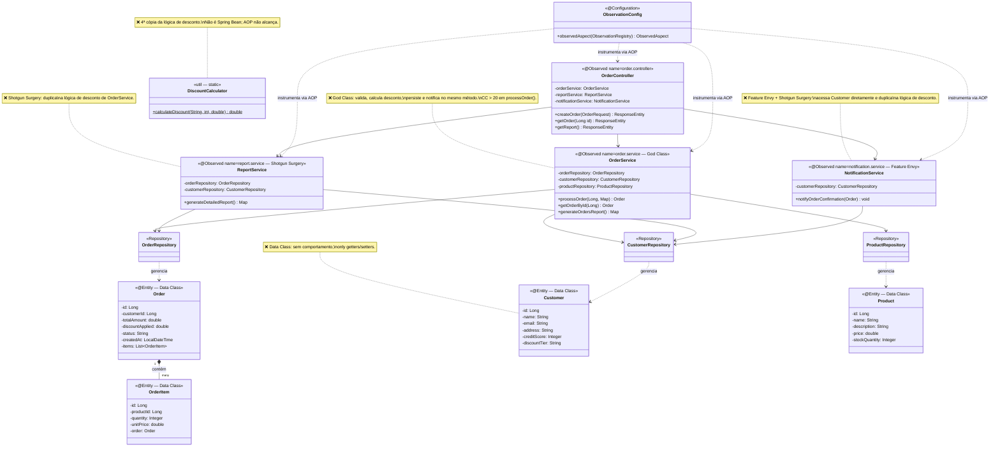

# refactoring-metrics

**Protótipo Java para o TCC**
**Mitigação de Débito Técnico Estrutural: Uma Abordagem Híbrida de Refatoração Baseada em Observabilidade e Métricas de Qualidade**

Autor: Diogo Mascarenhas — Sistemas de Informação, IFBA

---

## Visão Geral

Este repositório é o **único ponto de entrada** do TCC: contém o protótipo Spring Boot com **code smells intencionais** e toda a stack de observabilidade necessária para coletar métricas antes e após a refatoração.

- O **protótipo Java** roda diretamente no host (`./mvnw spring-boot:run`)
- A **infra de observabilidade** roda em Docker (`infra/docker-compose.infra.yml`)
- **Micrometer Observation API** (`@Observed`) instrumenta os beans principais para captura de latência e profundidade de pilha em tempo de execução

### Guias de Observabilidade

| Ferramenta | Guia | O que cobre |
|---|---|---|
| Prometheus + Micrometer | [`docs/guides/prometheus-micrometer.md`](docs/guides/prometheus-micrometer.md) | Modelo de dados, Observation API, PromQL de referência |
| Grafana | [`docs/guides/grafana.md`](docs/guides/grafana.md) | Interpretação de painéis, correlação experimental, exportação de dados |
| K6 | [`docs/guides/k6-load-testing.md`](docs/guides/k6-load-testing.md) | Metodologia RED, perfil de carga, protocolo de coleta |
| SonarQube | [`docs/guides/sonarqube.md`](docs/guides/sonarqube.md) | Scanner, Quality Gate rigoroso, extração de métricas via API |

---

## Diagrama de Classes

> Code smells intencionais evidenciados no diagrama: God Class (`OrderService`), Shotgun Surgery (lógica de desconto replicada em 4 lugares), Feature Envy (acesso a campos de `Customer` de fora da classe) e Data Class (`Customer`, `Product`).



---

## Estrutura do Projeto

```
refactoring-metrics/
├── pom.xml                                        # Deps: AOP, Micrometer, Sonar, JaCoCo
├── README.md
│
├── infra/                                         # Stack de observabilidade (Docker)
│   ├── docker-compose.infra.yml                   # SonarQube, Postgres, Prometheus, Grafana, K6
│   ├── prometheus.yml                             # Scrape config (host.docker.internal:8080)
│   ├── sonar-analysis.md                          # Guia operacional SonarQube + extração de métricas
│   ├── k6/
│   │   └── load-test.js                           # Script de carga (SharedArray + groups + custom metrics)
│   └── grafana/
│       └── provisioning/
│           ├── datasources/
│           │   └── prometheus.yml                 # Datasource pré-provisionado
│           └── dashboards/
│               ├── dashboards.yml                 # Provider config
│               ├── tcc-endpoints-k6.json          # Dashboard: latência, throughput, @Observed
│               └── tcc-jvm-spring-boot.json       # Dashboard: JVM heap, threads, GC, CPU
│
└── src/main/java/br/edu/ifba/tcc/
    ├── TccPrototipoApplication.java
    ├── ObservationConfig.java                     # Bean ObservedAspect (habilita @Observed via AOP)
    ├── OpenApiConfig.java
    ├── controller/
    │   └── OrderController.java                   # @Observed — order.controller.seconds
    ├── service/
    │   ├── OrderService.java                      # @Observed — order.service.seconds (God Class)
    │   ├── ReportService.java                     # @Observed — report.service.seconds (N+1)
    │   └── NotificationService.java               # @Observed — notification.service.seconds
    ├── model/                                     # Customer, Order, OrderItem, Product (Data Classes)
    ├── repository/                                # CustomerRepository, OrderRepository, ProductRepository
    └── util/
        └── DiscountCalculator.java                # Lógica de desconto duplicada (Shotgun Surgery)
```

---

## Containers da Infra

| Container | Imagem | Porta | Função |
|---|---|---|---|
| `tcc-sonarqube` | `sonarqube:community` | 9000 | Análise estática: CC, CBO, LCOM, TDR, code smells |
| `tcc-postgres` | `postgres:15-alpine` | 5432 | Banco de dados do SonarQube |
| `tcc-prometheus` | `prom/prometheus:latest` | 9090 | Coleta `/actuator/prometheus` a cada 5s |
| `tcc-grafana` | `grafana/grafana:latest` | 3000 | Dashboards pré-provisionados (2 dashboards) |
| `tcc-k6` | `grafana/k6:latest` | — | Testes de carga (profile `testing`) |

---

## Pré-requisitos

- **Java 21** instalado no host
- **Maven 3.9+** (ou usar `./mvnw`)
- **Docker Engine** (Linux) ou **Docker Desktop** (Windows/macOS)
- **`vm.max_map_count ≥ 524288`** no host (exigido pelo Elasticsearch do SonarQube — ver [Troubleshooting](#troubleshooting))

---

## Subindo o Ambiente

### 1. Stack de infra (Docker)

```bash
docker compose -f infra/docker-compose.infra.yml up -d
```

Aguarde ~60s para o SonarQube inicializar.

### 2. Protótipo Spring Boot (host)

```bash
./mvnw spring-boot:run
```

### 3. Verificar

```bash
# Actuator respondendo?
curl http://localhost:8080/actuator/health

# Prometheus exposto?
curl http://localhost:8080/actuator/prometheus | grep "order_service"
# Esperado: order_service_seconds_bucket, order_service_seconds_count

# Prometheus scraping? → http://localhost:9090/targets (spring-boot-prototipo = UP)
```

### Parar tudo

```bash
# Spring Boot: Ctrl+C
docker compose -f infra/docker-compose.infra.yml down
```

---

## URLs de Acesso

| URL | Descrição | Credenciais |
|---|---|---|
| `http://localhost:8080/swagger-ui.html` | Swagger UI | — |
| `http://localhost:8080/actuator/health` | Health check | — |
| `http://localhost:8080/actuator/prometheus` | Métricas Prometheus | — |
| `http://localhost:9000` | SonarQube | `admin` / `admin` ¹ |
| `http://localhost:9090` | Prometheus | — |
| `http://localhost:9090/targets` | Status dos scrapes | — |
| `http://localhost:3000` | Grafana | `admin` / `admin` |

> ¹ O SonarQube exige troca de senha no primeiro acesso.

---

## Instrumentação — Micrometer Observation API

Os beans principais estão anotados com `@Observed` (nível de classe), o que faz o `ObservedAspect` criar uma **Observation para cada método público**, gerando automaticamente no Prometheus:

| Bean | Métrica Prometheus | Smell Evidenciado |
|---|---|---|
| `OrderController` | `order_controller_seconds` | — |
| `OrderService` | `order_service_seconds` | **God Class / Long Method** |
| `ReportService` | `report_service_seconds` | **Shotgun Surgery / N+1** |
| `NotificationService` | `notification_service_seconds` | **Feature Envy** |

**PromQL úteis no Grafana:**

```promql
# p95 do processOrder (Long Method sob carga)
histogram_quantile(0.95,
  sum(rate(order_service_seconds_bucket{job="spring-boot-prototipo"}[1m])) by (le)
) * 1000

# Comparação cross-bean: quanto cada bean contribui para a latência total
histogram_quantile(0.95,
  sum by (le, __name__) (
    rate({job="spring-boot-prototipo", __name__=~".*_service_seconds_bucket"}[1m])
  )
) * 1000
```

---

## Análise Estática (SonarQube)

> Guia completo em [`infra/sonar-analysis.md`](infra/sonar-analysis.md)

```bash
# 1. Gere o token: http://localhost:9000 → Administration → Security → Users → Tokens
export SONAR_TOKEN=<token-gerado>

# 2. Rode com testes + cobertura JaCoCo + análise Sonar
./mvnw clean verify sonar:sonar -Dsonar.token=$SONAR_TOKEN
```

Métricas capturadas: CC, ncloc, cognitive_complexity, `sqale_debt_ratio`, violations, duplicated_lines_density.

---

## Testes de Carga (K6)

```bash
docker compose -f infra/docker-compose.infra.yml \
  --profile testing run --rm k6 run /scripts/load-test.js
```

### Endpoints cobertos

| Grupo K6 | Endpoint | Smell exercitado |
|---|---|---|
| `criar-pedido` | `POST /orders` | Long Method (`processOrder`) |
| `consultar-pedido` | `GET /orders/{id}` | N+1 implícito |
| `relatorio` | `GET /orders/report` | Shotgun Surgery + N+1 |
| `health` | `GET /actuator/health` | baseline |

### Perfil de carga

| Etapa | Duração | VUs | Propósito |
|---|---|---|---|
| Ramp-up | 30s | 0 → 10 | Aquecimento gradual |
| Sustentada | 2min | 10 | Comportamento em carga normal |
| Pico | 30s | 10 → 50 | Spike de tráfego |
| Carga de pico | 1min | 50 | Comportamento sob estresse |
| Ramp-down | 30s | 50 → 0 | Recuperação |

**Thresholds:** `p(95) < 2s` · `taxa de erro < 5%`

---

## Dashboards Grafana (pré-provisionados)

| Dashboard | UID | Conteúdo |
|---|---|---|
| TCC — Endpoints & Carga (K6) | `tcc-endpoints-k6` | Taxa erro, throughput, p50/p95/p99 por endpoint, **@Observed cross-bean** |
| TCC — JVM & Runtime | `tcc-jvm-spring-boot` | Heap/NonHeap, threads, GC pauses, CPU |

---

## Métricas do Experimento

### Code Smells — Detecção Estática (SonarQube)

| Code Smell | Problema Central | Classe no Protótipo |
|---|---|---|
| God Class | Alta complexidade, múltiplas responsabilidades | `OrderService` |
| Long Method | CC > 20, método com 100+ linhas | `OrderService.processOrder()` |
| Feature Envy | Acessa dados de `Customer` e `Product` de fora | `OrderService`, `NotificationService` |
| Shotgun Surgery | Lógica de desconto em 4 classes | `OrderService`, `ReportService`, `NotificationService`, `DiscountCalculator` |
| Data Class | Só getters/setters, sem comportamento | `Customer`, `Product`, `Order`, `OrderItem` |
| Dispersed Coupling | Dependências concretas sem interfaces | `OrderService` → 3 repos concretos |

### Métricas Estáticas (SonarQube)

| Métrica | Sigla | SonarQube Key |
|---|---|---|
| Complexidade Ciclomática | CC / WMC | `complexity` |
| Linhas de Código | LOC | `ncloc` |
| Complexidade Cognitiva | — | `cognitive_complexity` |
| Technical Debt Ratio | TDR | `sqale_debt_ratio` |
| Acoplamento Eferente | Ce / Fan-Out | `violations` (coupling rules) |
| Duplicações | — | `duplicated_lines_density` |

### Métricas Dinâmicas (Micrometer → Prometheus → Grafana)

| Métrica | Ferramenta | O que demonstra |
|---|---|---|
| Latência p50/p95/p99 por endpoint | Micrometer → Prometheus → Grafana | Impacto direto da refatoração no tempo de resposta |
| Taxa de erro (%) | Micrometer | Estabilidade antes e depois |
| Throughput (req/s) | K6 | Capacidade sob carga após refatoração |
| Tempo de execução por método | `@Observed` (Observation API) | Identifica gargalos ligados aos smells detectados estaticamente |
| Taxa de erro por bean | `@Observed` + tag `error` | Correlaciona smells com falhas em runtime |

---

## Workflow do Experimento

```
Fase 1 — BASELINE                     Fase 3 — PÓS-REFATORAÇÃO
─────────────────                     ──────────────────────────
1. docker compose up -d               1. (mesmo comando)
2. ./mvnw spring-boot:run             2. ./mvnw spring-boot:run
3. ./mvnw clean verify sonar:sonar    3. ./mvnw clean verify sonar:sonar
4. Exportar métricas via API Sonar    4. Exportar métricas via API Sonar
5. Rodar K6 load test                 5. Rodar K6 (mesma carga)
6. Capturar dashboards Grafana        6. Capturar dashboards Grafana
7. Salvar em docs/baseline/           7. Salvar em docs/pos-refatoracao/
                                      8. Alterar fase: "pos-refatoracao"
                                         em infra/prometheus.yml
```

---

## Troubleshooting

### SonarQube não sobe — `vm.max_map_count`

```bash
# Linux — imediato
sudo sysctl -w vm.max_map_count=524288

# Persistir
echo "vm.max_map_count=524288" | sudo tee -a /etc/sysctl.conf && sudo sysctl -p
```

```powershell
# Windows (WSL2)
wsl -d docker-desktop sysctl -w vm.max_map_count=524288
```

### Prometheus com status DOWN em `/targets`

1. `curl http://localhost:8080/actuator/health` deve retornar `{"status":"UP"}`
2. O container Prometheus precisa de `extra_hosts: host.docker.internal:host-gateway`
3. `docker logs tcc-prometheus`

### `@Observed` não gera métricas no Prometheus

Verificar:
1. `spring-boot-starter-aop` está no classpath: `./mvnw dependency:tree | grep aop`
2. Bean `ObservedAspect` configurado: `ObservationConfig.java` existe
3. `management.observations.annotations.enabled=true` em `application.properties`
4. A classe alvo é um **Spring Bean** (não pode ser `static` ou instanciada com `new`)

### Limites de recursos dos containers

| Container | RAM (limite) |
|---|---|
| `tcc-sonarqube` | 3 GB |
| `tcc-postgres` | 512 MB |
| `tcc-prometheus` | 512 MB |
| `tcc-grafana` | 256 MB |
| **Total** | **~4,3 GB** |

```bash
# Subir apenas observabilidade dinâmica (sem SonarQube)
docker compose -f infra/docker-compose.infra.yml up -d prometheus grafana

# Subir apenas análise estática (sem Prometheus/Grafana)
docker compose -f infra/docker-compose.infra.yml up -d sonarqube postgres
```
